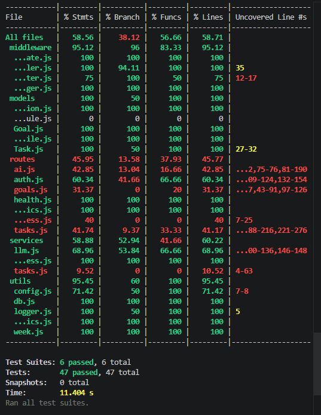

# Test Coverage Report

## Tool Used

The backend test coverage was generated using Jest.

## Command Used

```bash
cd server
npm run test:coverage
```

## Coverage Summary

Latest coverage result:

| Metric     | Result |
| ---------- | -----: |
| Statements | 58.56% |
| Branches   | 38.12% |
| Functions  | 56.66% |
| Lines      | 58.71% |

The project meets the minimum required coverage threshold of 50% for statements and lines.

## Covered Areas

The test suite includes coverage for:

* Authentication route behavior
* Protected route behavior
* AI output validation
* AI reschedule output validation
* Context sanitization for AI prompts
* Progress calculation
* Middleware and error handling
* Metrics endpoint
* AI suggestion to accepted task flow

## Evidence

Coverage screenshot:

```txt
docs/images/test-coverage.png
```



## Notes

The coverage report was generated locally using Jest. The result shows that the backend has sufficient automated test coverage for the main application logic.
